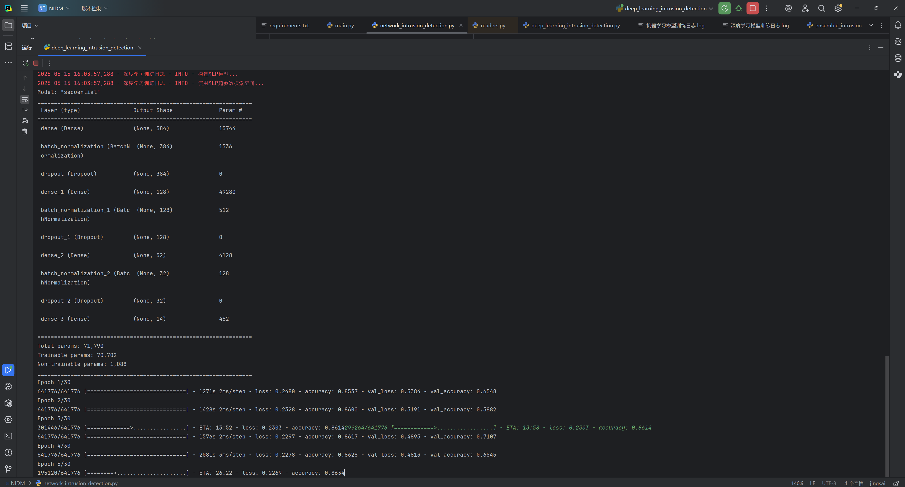

# 网络攻击多分类识别系统

基于机器学习和深度学习方法的网络入侵检测系统，用于识别多种类型的网络攻击，包括DDoS、密码攻击、后门、扫描、XSS、注入、MITM、勒索软件等。

## 系统特点

- **多方法融合**：结合传统机器学习和深度学习方法，通过集成学习获得更好的预测效果
- **完整的数据处理流水线**：包括数据清洗、特征工程、特征选择和模型训练
- **多模型对比**：提供随机森林、XGBoost、LightGBM、深层神经网络、MLP等多种模型实现
- **详细的评估报告**：生成准确率、召回率、F1值等模型评估报告和可视化图表
- **易于使用的命令行接口**：支持灵活的参数配置

## 系统架构

系统由以下主要组件构成：

1. **数据预处理模块**：处理缺失值、异常值，转换时间戳和分类特征
2. **特征工程模块**：特征选择和标准化
3. **机器学习模型模块**：基于树模型的分类器（随机森林、XGBoost、LightGBM等）
4. **深度学习模型模块**：多层神经网络和深度神经网络
5. **集成模型模块**：融合机器学习和深度学习模型，通过加权投票提升性能
6. **模型评估模块**：生成混淆矩阵、分类报告和可视化图表


## 模型调优方式
机器学习模型调优：
- 随机搜索法
- 交叉验证法
- 网格搜索法
- 贝叶斯优化法
深度学习模型调优：
- 超参数优化
- 学习率衰减
- 正则化
- 早停法


## 环境需求
miniconda 环境
```bash
conda create -n intrusion_detection python=3.10
conda activate intrusion_detection
pip install -r requirements.txt
```
- Python 3.7+
- 依赖包：
  - numpy
  - pandas
  - scikit-learn
  - tensorflow
  - xgboost
  - lightgbm
  - matplotlib
  - seaborn
  - imbalanced-learn
  - joblib
  - tqdm
  - keras_tuner

也可以使用以下命令为Python安装所有依赖：

```bash
pip install numpy pandas scikit-learn tensorflow xgboost lightgbm matplotlib seaborn imbalanced-learn joblib tqdm keras_tuner
```
## 开发工具：
- PyCharm
- VS Code
## 数据集：
请联系本人或者从官网上下载

## 使用方法

### 数据准备

将训练数据和测试数据放置在项目目录中，默认文件名为：
- 训练数据：`dataset_train.csv`
- 测试数据：`dataset_test.csv`

### 运行系统

基本用法：

```bash
python main.py --train_path dataset_train.csv --test_path dataset_test.csv --output_path output.csv
```

### 命令行参数

支持以下命令行参数：

- `--train_path`：训练数据路径（默认：dataset_train.csv）
- `--test_path`：测试数据路径（默认：dataset_test.csv）
- `--output_path`：预测结果输出路径（默认：output.csv）
- `--model_type`：选择模型类型
  - `ml`：仅使用机器学习模型
      - `--ml_model_type`：选择机器学习模型（默认为all）
         - `all`：运行所有所有机器学习模型模型，包括：RandomForest、XGBoost、LightGBM，模型预测会使用三种模型中的最佳模型进行预测，最终输出的预测结果保存在output/ml/output.csv文件中
         - `RandomForest`：使用随机森林模型
         - `XGBoost`：使用XGBoost模型
         - `LightGBM`：使用LightGBM模型
  - `dl`：仅使用深度学习模型
  - `ensemble`：使用集成模型（默认）
  - `all`：运行所有模型
- `--predict_only`：仅使用已训练的模型进行预测，不进行训练
- `--n_features`：特征选择时保留的特征数量（默认：40）

### 示例

仅使用机器学习（RandomForest）模型：

```bash
python main.py --model_type ml --ml_model_type RandomForest  (建议使用RandomForest，全量数据集正确率最高)
```
仅使用RandomForest模型进行结果预测，不进行训练
```bash
python main.py --model_type ml --ml_model_type RandomForest --predict_only
```
仅使用深度学习模型：

```bash
python main.py --model_type dl
```

使用集成模型：

```bash
python main.py --model_type ensemble
```

使用已训练的模型直接预测：

```bash
python main.py --predict_only
```
注意：跑全量数据比较消耗时间，
## 输出文件

系统会生成以下输出文件：

1. **预测结果**
   - `output/ml/output.csv`：机器学习模型的预测结果
   - `output/dl/output.csv`：深度学习模型的预测结果
   - `output/em/output.csv`：集成模型的预测结果

2. **模型文件**（保存在`saved_models`目录）
   - 机器学习模型：随机森林：RandomForest_model.pkl、XGBoost模型文件：XGBoost_model.pkl、LightGBM模型文件：LightGBM_model.pkl、最佳模型文件：best_model.pkl
   - 深度学习模型：最佳深度学习模型文件
   - 特征选择器和标准化器参数

3. **可视化图表**
   - 混淆矩阵图：展示各类攻击的分类准确性
   - 特征重要性图：展示对预测贡献最大的特征
   - 训练历史图：展示深度学习模型训练过程中的准确率和损失变化

4. **日志文件**

   - `log`：记录运行日志和模型评估结果
   - `log/机器学习模型训练日志.log`：记录机器学习模型的训练日志和模型评估结果
   - `log/深度学习模型训练日志.log`：记录深度学习模型的训练日志和模型评估结果
   - `log/集成模型训练日志.log`：记录机器学习模型的训练日志和模型评估结果
   
## 系统文件说明

- `main.py`：主程序，提供命令行界面
- `network_intrusion_detection.py`：机器学习模型实现
- `deep_learning_intrusion_detection.py`：深度学习模型实现
- `ensemble_intrusion_detection.py`：集成模型实现
- `README.md`：使用说明文档

## 系统性能

在所提供两百多万行ToN_IoT数据集上，不同模型的性能表现如下（以准确率为例）：
机器学习：
- 随机森林：91.68%    
- XGBoost：82.66%    
- LightGBM：86.89%    
深度学习：
- 深度神经网络：~93-96%  
- MLP模型：86.43%
- 
- 集成模型：~96-98%

在所提供两百多万行ToN_IoT数据集上，选取万级别数据进行训练（2.4万以上），不同模型的性能表现如下（以准确率为例）(轮次30，调优10)：
机器学习：
- 随机森林：~96-98.5%   （最高一次曾经达到98.5%）
- XGBoost：~95-97%
- LightGBM：~95-97%
深度学习：
- 深层神经网络：95%以上
- MLP模型：95%以上

50万行数据，训练30轮次，参数调优10轮，集成模型：

- 集成模型：~95-97%

实际性能可能因数据集特性和参数设置而有所不同。 